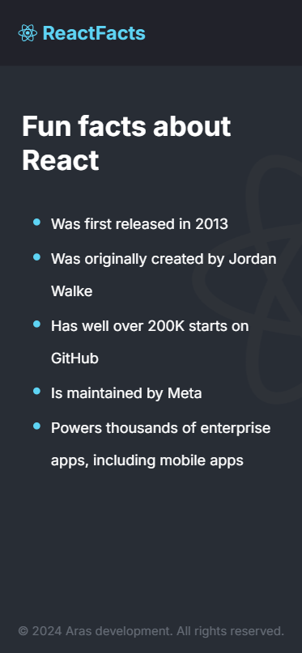
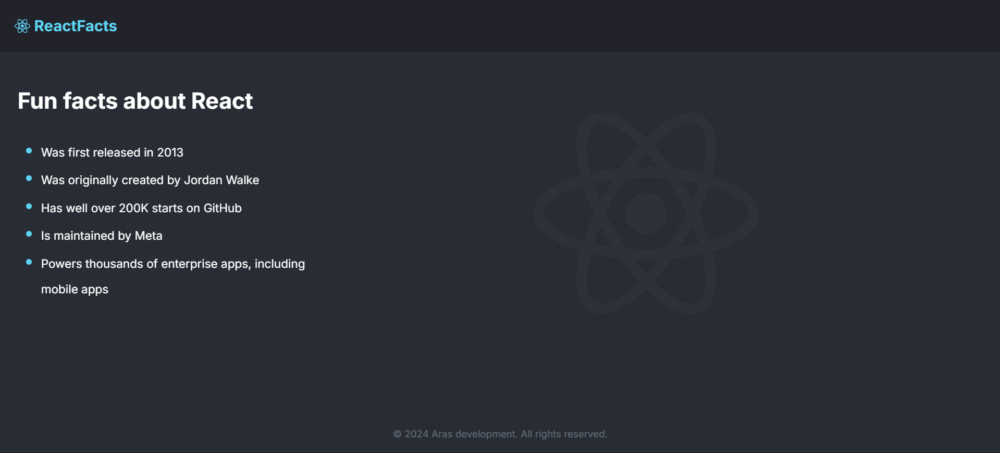

# React Facts

Página estática construída no React.

## Stack utilizada

**Front-end:** React.js, Vite (setup do projeto), CSS, JavaScript;

## Funcionalidades

- Responsivo para telas de diferentes tamanhos;

## Deploy

Para fazer o deploy desse projeto localmente:

```bash
  git clone https://github.com/rebecaaras/react-facts-page.git
  cd react-facts-page
```

Instale as dependências:
```bash
npm install
```

Execute localmente:
```bash
npm run dev
```
Acesse em: http://localhost:5173/

## Demonstração
<figure>
  
  <figcaption>Mobile</figcaption>
</figure>
<figure>
  
  <figcaption>Tela desktop dividida</figcaption>
</figure>
<figure>
  
  <figcaption>Desktop</figcaption>
</figure>


